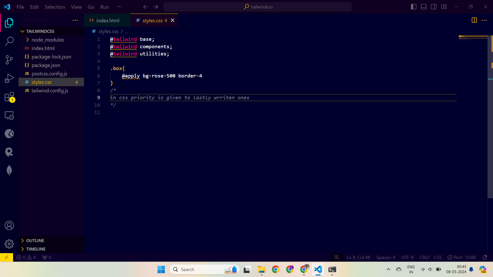

# Tailwind CSS Demo

This project is a demonstration of using Tailwind CSS, a utility-first CSS framework, to style an HTML page.

## Introduction

Tailwind CSS is a popular CSS framework that allows developers to quickly style HTML elements using utility classes. This project serves as a showcase of the various features and capabilities of Tailwind CSS.

## Getting Started

To view the styled HTML page, simply open the `index.html` file in a modern web browser.

### Prerequisites

No special prerequisites are needed to view the page. Any modern web browser should work seamlessly.

## Features Explored

### 1. Tailwind CSS Integration

- Included Tailwind CSS in the project using a separate CSS file (`styles.css`), enabling more flexibility and customization.

### 2. Utility Classes

- Extensively utilized Tailwind CSS utility classes to apply styles to various elements without writing custom CSS, showcasing the efficiency of utility-first approach.

### 3. Typography Styling

- Explored different font families, sizes, and styles using Tailwind CSS classes such as `font-sans`, `font-serif`, `font-mono`, `text-xl`, `text-base`, `italic`, `font-bold`, etc.

### 4. Layout Design

- Utilized Flexbox and Tailwind CSS classes like `flex`, `justify-between`, `items-center`, `mx-48`, `flex-wrap`, etc., to create responsive and well-structured layouts.

### 5. Element Styling

- Styled various HTML elements including `
`, `
`, and `<h1>` using Tailwind CSS classes for background color, text color, padding, margin, border, rounded corners, etc.

### 6. Responsive Design

- Demonstrated responsiveness using Tailwind CSS responsive utilities (`sm:`, `md:`) for background color, text alignment, etc., ensuring the design adapts well to different screen sizes.

### 7. Form Styling

- Created a subscription form and styled it using Tailwind CSS classes for input fields, buttons, margins, padding, background color, text color, etc., enhancing visual appeal and user experience.

### 8. Comments and Documentation

- Included comments within the HTML code to explain the purpose of different sections and classes, aiding in understanding and maintaining the codebase.

### Working

## Contributing

Contributions are welcome! If you find any issues or have suggestions for improvement, feel free to open an issue or create a pull request.

